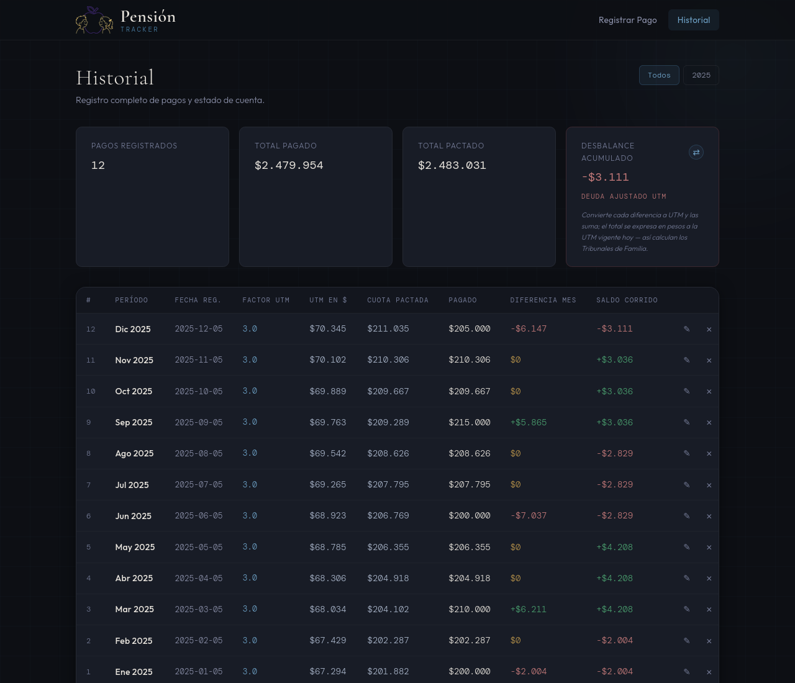
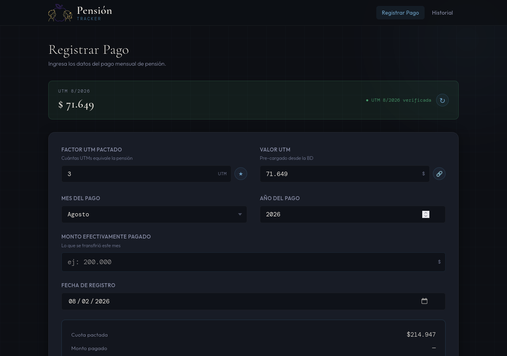
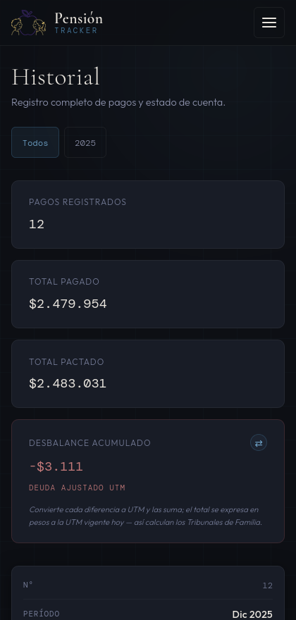

<div align="center">


# Pensión Tracker

**Lleva el registro de los pagos de pensión alimenticia, en UTM, sin que tus datos salgan de tu computador.**

[](LICENSE)
[](https://github.com/pataguadark/pension_tracker/actions/workflows/build.yml)
[](https://github.com/pataguadark/pension_tracker/releases/latest)
[](https://link.mercadopago.cl/pension_tracker)
[](https://www.paypal.com/donate/?hosted_button_id=2PFWY58A55FQE)

</div>

---

## Qué es

En Chile las pensiones alimenticias se pactan habitualmente **en UTM**, no en pesos.
Eso significa que el monto que corresponde pagar **cambia todos los meses**, y llevar
la cuenta a mano —en un cuaderno o en una planilla— se vuelve un problema: hay que
buscar la UTM del mes, multiplicarla por el factor pactado, comparar contra lo que
efectivamente se pagó y arrastrar la diferencia.

Pensión Tracker hace eso por ti. Registras el pago del mes y la app calcula la cuota
que correspondía, si el pago quedó exacto, deficiente o en exceso, y mantiene el
**saldo acumulado corrido** a lo largo del tiempo.

## Para quién

Para cualquiera de las dos partes de un acuerdo de pensión alimenticia en Chile
—quien paga o quien recibe— que necesite un registro ordenado, propio y verificable
de lo que se pagó mes a mes.

> **No es asesoría legal.** Es una herramienta de registro personal. Los cálculos son
> aritmética sobre los datos que tú ingresas, y no reemplazan a un abogado, al
> tribunal ni a una liquidación oficial.

## Cómo se ve

<div align="center">



*Historial: totales del año, desbalance acumulado y saldo corrido mes a mes.*

<br>



*Registro: la UTM del mes se trae sola y la cuota pactada se calcula mientras escribes.*

<br>



*En el celular la tabla se convierte en tarjetas.*

</div>

> Todas las cifras de las capturas son **datos de ejemplo**, generados para la
> documentación.

## Tus datos nunca salen de tu equipo

Esta es la premisa del proyecto, no un detalle:

- **No hay servidor, ni cuenta, ni nube.** La base de datos es un archivo SQLite en
  tu propio computador.
- **No hay analítica, telemetría ni reporte de errores.** Ninguno.
- **No hay recursos externos.** Las fuentes tipográficas y los iconos vienen dentro
  de la app; el navegador no contacta a ningún CDN.
- **Una sola petición de red en toda la app:** consultar el valor de la UTM en
  [mindicador.cl](https://mindicador.cl/), y la hace el backend, no tu navegador.
  Esa petición no lleva ninguno de tus datos. Si no hay internet, la app funciona
  igual con la última UTM guardada o con ingreso manual.
- **El servidor escucha solo en `127.0.0.1`**, salvo que tú actives explícitamente el
  modo `--lan`.

---

## Instalación

Descarga el archivo de tu sistema operativo desde la
**[última versión publicada](https://github.com/pataguadark/pension_tracker/releases/latest)**.

Los binarios **no están firmados digitalmente** (los certificados de firma son de
pago). No es que la app sea peligrosa: es que Windows y macOS desconfían por defecto
de cualquier programa sin firma. Abajo está cómo pasar ese aviso en cada sistema. Si
prefieres no confiar en un binario, siempre puedes
[correr la app desde el código fuente](#desarrollo).

### Windows

1. Descarga `PensionTracker-windows.zip` y descomprímelo donde quieras.
2. Entra a la carpeta y ejecuta `PensionTracker.exe`.
3. **SmartScreen** va a mostrar *"Windows protegió su PC"*. Haz clic en
   **Más información** → **Ejecutar de todas formas**. Solo la primera vez.

### macOS

1. Descarga `PensionTracker-macos.zip` y descomprímelo.
2. Arrastra `PensionTracker.app` a tu carpeta de Aplicaciones.
3. **Gatekeeper** va a decir que la app *"está dañada"* o que *"no se puede
   verificar el desarrollador"*. Es el mensaje estándar para apps sin firmar.
   Ábrela una vez con **clic derecho → Abrir**, o quita la marca de cuarentena
   desde la Terminal:

   ```bash
   xattr -dr com.apple.quarantine /Applications/PensionTracker.app
   ```

> **Nota:** el binario de macOS se compila para **Apple Silicon** (M1 y
> posteriores). En Macs con procesador Intel, corre la app
> [desde el código fuente](#desarrollo).

### Linux

1. Descarga `PensionTracker-x86_64.AppImage`.
2. Dale permisos de ejecución y ábrelo:

   ```bash
   chmod +x PensionTracker-x86_64.AppImage
   ./PensionTracker-x86_64.AppImage
   ```

La ventana nativa necesita **WebKitGTK** instalado en el sistema
(`libwebkit2gtk-4.1` en Debian/Ubuntu, `webkit2gtk-4.1` en Arch, `webkit2gtk4.1`
en Fedora). Si no está disponible, la app abre igual en tu navegador por defecto.

### Desde el celular (PWA)

Pensión Tracker es también una **PWA instalable**. Todavía no hay apps nativas en
las tiendas (ver [Roadmap](#roadmap)), pero puedes usarla desde el teléfono si el
computador donde corre está en la misma red. Lanza la app con `--lan` desde la
terminal:

```bash
./PensionTracker-x86_64.AppImage --lan   # Linux
PensionTracker.exe --lan                 # Windows
PensionTracker.app/Contents/MacOS/PensionTracker --lan   # macOS
pensiontracker --lan                     # desde el código fuente
```

La app imprime la dirección exacta a abrir desde el celular, con la IP real de tu
equipo en la red:

```
AVISO: modo --lan activo. El servidor es accesible desde cualquier dispositivo
de tu red local; úsalo solo en redes de confianza.
[pensiontracker] Desde tu celular, abre: http://192.168.1.9:7040/registro
```

Desde el navegador del teléfono elige **"Agregar a la pantalla de inicio"** y queda
como una app más.

> El modo `--lan` expone el servidor a **toda tu red local**. Úsalo solo en redes de
> confianza —tu casa—, nunca en un wifi público, y apágalo cuando no lo necesites.

---

## Qué hace

- **Registro de pagos** con cálculo automático de la cuota pactada (Factor UTM ×
  Valor UTM) y del desbalance del mes.
- **Pre-carga inteligente**: el último valor UTM y el último factor pactado se cargan
  solos en el formulario.
- **Autoformateo chileno** en los campos: miles con punto (`69.889`), decimales con
  coma (`3,0561`).
- **Historial filtrable por año**, con totales, desbalance acumulado y doble lectura
  del saldo: **en pesos** y **en UTM**. En pantallas angostas se muestra como
  tarjetas en vez de tabla.
- **Edición y eliminación** de registros individuales.
- **UTM automática** desde mindicador.cl, con refresco al arrancar, botón de refresco
  manual, fallback a la última UTM guardada e ingreso manual siempre disponible.
- **Completar meses pasados**: al elegir un mes anterior, la app trae la UTM que
  correspondía a ese mes (con caché por año).
- **Exportación a CSV** (separador `;`, se abre bien en Excel en Chile) y **respaldo
  binario** de la base de datos completa.
- **Funciona offline**: service worker + todos los recursos embebidos.

## Dónde quedan tus datos

La base de datos (`pension_tracker.db`) y la clave de sesión (`secret_key`) viven en
el directorio de datos de tu usuario, **fuera** de la carpeta del programa, así que
sobreviven a desinstalaciones y actualizaciones:

| Sistema | Ruta |
|---|---|
| Linux | `~/.local/share/PensionTracker/` |
| macOS | `~/Library/Application Support/PensionTracker/` |
| Windows | `%LOCALAPPDATA%\PensionTracker\` |

En Linux y macOS el directorio queda con permisos `0700` y los archivos con `0600`.

**Para respaldar tus datos**, usa el botón de respaldo dentro de la app (descarga un
`.db` íntegro vía la API `.backup` de SQLite) o copia ese archivo a mano.

---

## Limitaciones conocidas

Vale la pena decirlas de frente:

- **La base de datos no está cifrada.** Es un archivo SQLite en claro. Está protegido
  por los permisos de tu usuario, pero cualquiera con acceso físico o administrativo
  a tu equipo puede leerlo. El cifrado con SQLCipher está en el roadmap. Si compartes
  el computador, tenlo presente.
- **Los binarios no están firmados** — de ahí los avisos de SmartScreen y Gatekeeper.
- **macOS solo Apple Silicon** por ahora.
- **No hay restauración de respaldo desde la interfaz**: puedes descargar el `.db`,
  pero para restaurarlo hay que copiarlo a mano al directorio de datos.
- **No hay apps nativas de Android ni iOS** todavía, solo la PWA vía `--lan`.
- **La app no valida tu acuerdo**: el factor UTM lo ingresas tú y la app confía en él.

## Roadmap

- [ ] Cifrado de la base de datos (SQLCipher)
- [ ] Restaurar respaldo desde la propia interfaz
- [ ] App Android nativa (Capacitor)
- [ ] App iOS nativa (Capacitor)
- [ ] Instalador propiamente tal en Windows, y build para Mac Intel
- [ ] Reporte imprimible / PDF del historial

---

## Desarrollo

Requisitos: **Python 3.12+** y [uv](https://docs.astral.sh/uv/). No hace falta crear
un entorno virtual a mano ni usar `pip`.

```bash
git clone https://github.com/pataguadark/pension_tracker.git
cd pension_tracker
uv sync
uv run pensiontracker --browser
```

Abre **http://127.0.0.1:7040/registro**.

Modos de lanzamiento:

```bash
uv run pensiontracker            # ventana nativa (pywebview); si no hay backend
                                 # disponible, cae al navegador del sistema
uv run pensiontracker --browser  # servidor Flask plano, sin ventana nativa
uv run pensiontracker --lan      # expone en la red local (0.0.0.0) para el celular
```

Para recarga automática al guardar, `export PT_DEBUG=1` antes de arrancar (o copia
`.env.example` a `.env`).

### Tests

```bash
uv run pytest
```

270 tests, aislados por completo de tu base de datos real: cada uno usa una BD SQLite
temporal (`tmp_path`).

### Construir los binarios

```bash
uv run pyinstaller packaging/pensiontracker.spec
```

Genera `dist/PensionTracker/` (onedir), que corre sin `uv` ni Python instalados. En
Linux, `packaging/appimage/build-appimage.sh` lo empaqueta como AppImage (requiere
`appimagetool` en el `PATH`). El workflow `.github/workflows/build.yml` hace los tres
sistemas operativos y publica el release al empujar un tag `v*`.

### Estructura

```
pension_tracker/
├── pyproject.toml              # dependencias (uv), script de consola `pensiontracker`
├── .env.example                # variables opcionales: PT_PORT, PT_DEBUG
├── src/pensiontracker/
│   ├── __init__.py             # create_app() — application factory
│   ├── __main__.py             # CLI: pensiontracker [--browser | --lan]
│   ├── desktop.py              # launcher de escritorio (pywebview)
│   ├── config.py               # rutas de datos, secret key, PT_PORT/PT_DEBUG
│   ├── routes/                 # blueprints: pagos, utm, export
│   ├── services/               # calculation_service, utm_service
│   ├── database/               # db_manager (SQLite)
│   ├── static/                 # CSS, JS, fuentes, iconos, manifest, service worker
│   └── templates/              # HTML (Jinja2)
├── tests/                      # pytest — routes, db_manager, utm_service, cálculos
├── shared/fixtures/            # casos dorados que verifican Python y TypeScript
├── mobile/src/core/            # port de la aritmética a TypeScript (app Android)
├── packaging/                  # PyInstaller spec, iconos, receta AppImage
└── .github/workflows/          # build.yml (release) y tests.yml (ambas suites)
```

### Dos implementaciones de la misma aritmética

La app Android en preparación no puede reutilizar el código Python: Capacitor
envuelve una aplicación web y no ejecuta Python. Por eso la lógica de cálculo
existe dos veces, en `src/pensiontracker/` y en `mobile/src/core/`.

Que las dos divergieran significaría que alguien ve saldos distintos en su
computador y en su teléfono, sin saber cuál creer. Para impedirlo,
`shared/fixtures/*.json` guarda casos de entrada con su resultado esperado, y
**ambas suites leen esos mismos archivos**: `pytest` verifica la implementación
Python y `vitest` la de TypeScript. Si una se desvía, el CI se detiene.

```bash
npm install --prefix mobile
npm run typecheck --prefix mobile
npm test --prefix mobile
```

### Stack

Flask (application factory + blueprints) · SQLite · Jinja2 · Flask-WTF (CSRF) ·
requests · platformdirs · pywebview · pytest · PyInstaller.

### Variables de entorno (todas opcionales)

| Variable | Default | Uso |
|---|---|---|
| `PT_PORT` | `7040` | Puerto en modo `--browser` / `--lan` (en ventana nativa el puerto es efímero) |
| `PT_DEBUG` | apagado | `1` activa el modo debug de Flask |

La `SECRET_KEY` **no se configura**: se autogenera y persiste sola en el directorio
de datos del usuario.

### Seguridad

- Todo endpoint que escribe datos requiere **POST** y va protegido contra **CSRF**.
- La `SECRET_KEY` se autogenera por instalación; no hay fallback hardcodeado.
- Cabeceras `X-Content-Type-Options`, `X-Frame-Options`, `Referrer-Policy` y
  `Content-Security-Policy` en todas las respuestas.
- El servidor escucha solo en `127.0.0.1` salvo `--lan` explícito.

¿Encontraste un problema de seguridad? Repórtalo en privado por
[security advisories](https://github.com/pataguadark/pension_tracker/security/advisories/new),
no en un issue público.

---

## Contribuir

Los aportes son bienvenidos — lee [CONTRIBUTING.md](CONTRIBUTING.md). La regla
principal: **cero datos personales en el repositorio**, ni en el código, ni en los
tests, ni en los issues.

## Donar

Este proyecto es gratuito, sin publicidad y sin recolección de datos. Si te sirvió y
quieres aportar:

- **[MercadoPago](https://link.mercadopago.cl/pension_tracker)** — para Chile
- **[PayPal](https://www.paypal.com/donate/?hosted_button_id=2PFWY58A55FQE)** — desde el resto del mundo

## Licencia

[MIT](LICENSE) © 2026 pataguadark
